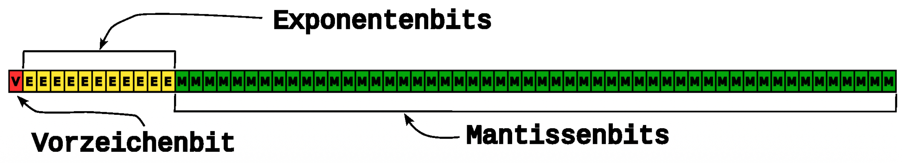
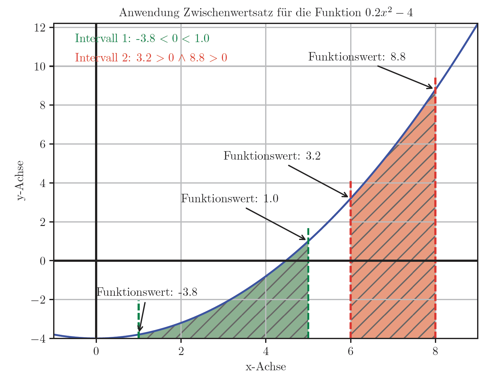
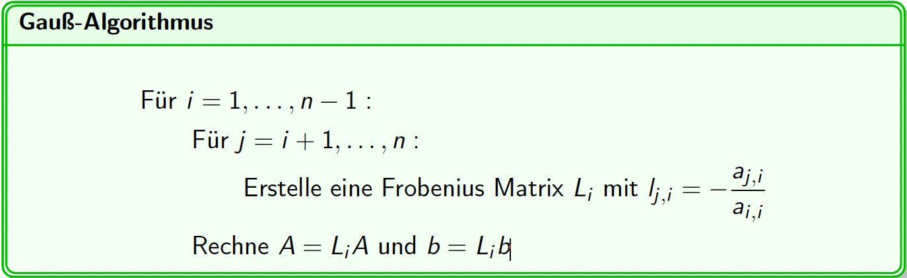
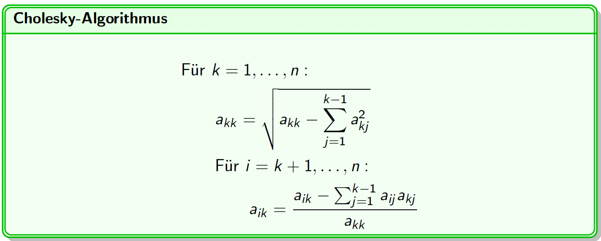

### Literatur 
- Bernd Klein: Einführung in Python
- Bernd Klein: Numerisches Python
- Woyand: Python für Ingenieure und Naturwissenschaftler
- Martin Hermann: Numerische Mathematik 1
### Klausur
30 % der Note durch Programmieraufgabe und Fachgespräch (10 min.)
70 % der Note Klausur (Programmcode schreiben, Numerische Verfahren)
Geschrieben im PC-Pool, programmieren in IDLE

### Zahlenformate
In Computerprogrammen werden aufgrund der begrenzten Speicherlänge (8, 16, 32 bit) andere Zahlenformate definiert als in der Mathematik. Darunter:
- Integer
- Floats
- Boolsche Werte (True, (1), False (0))
- Complex
Die mögliche Länge eines Integer wird durch den Arbeitsspeicher des Rechners festgelegt
**Wichtig** $\rightarrow$ eine Datentypumwandlung ist **keine** Rundungsoperation! 
float $\rightarrow$ int die Ziffern hinter dem Komma werden abgeschnitten
#### Zahlensysteme
##### Binär
- Basis 2 
- Nullen und Einsen
- entspricht der Maschinensprache 
Binärsystem: 1001101
$$
1 \cdot 2^6 + 0 \cdot 2^5 + 0 \cdot 2^4 + 1 \cdot 2^3 + 1 \cdot 2^2 + 0 \cdot 2^1 + 1 \cdot 2^0 = 77
$$
##### Hexadezimal
- Basis 16
- am platzsparendsten
Beispiel: 1D47
$$
1 \cdot 16^3 + 13 \cdot 16^2 + 4 \cdot 16^1 + 7 \cdot 16^0 = 7495
$$
#### Aufbau Fließkommazahlen
- Vorzeichenbit (1 bit)
	- Gibt das Vorzeichen an (0 = positiv, 1 = negativ)
- Exponentenbits (11 bits)
	- Gibt an wohin das Dezimalzeichen platziert wird
- Mantissenbits (52 bits)

Beispiel: 
1 | 0110 | 110001100111
$\rightarrow$ Vorzeichen negativ
$\rightarrow$ Dezimalzeichen um 6 Stellen verschoben (0110 = 6)
$\rightarrow$ alles dahinter geben die Zahlen vor und nach dem Dezimalzeichen an

## Fehler 
Buch: Martin Hermann; Numerik und Programmierung
### Fehlertypen
#### Eingabefehler 
- Liegen vor Beginn der Berechnung fest 
- können Werte aus vorheriger Messung oder Berechnung
- unvermeidbarer Fehler
#### Approximationsfehler
- unendlicher mathematischer Prozess durch endliche Berechnungsvorschrift ersetzen
- Approximieren von unendlichen Zahlen ($\pi,~e$)
- Bestimmtes Integral
#### Rundungsfehler
- Werte werden zur Anschaulichkeit gerundet
- dadurch können Rundungsfehler entstehen
- i. d. Regel sehr klein
- können sich fortpflanzen
#### Menschlicher Fehler / Irrtum
- grundlegende Fehler mathematischen/numerischen Modell
- konkrete Bedingung werden durch Fehlannahmen im Programm nicht zugelassen
- Debugging über Unit-testing (https://en.wikipedia.org/wiki/Unit_testing)

### Nullstellenalgorithmen
- Algorithmen zur Bestimmung der Nullstellen einer Funktion
#### Einführung
- Analystische Mathematik $\rightarrow$ $f(x) = 0$
- In der Numerik werden iterative Verfahren angewendet 
- Vorraussetzungen:
	- Hat die Funktion Nullstellen?
	- Gibt es einen Bereich, in dem eine Nullstelle vorkommt?
- Vorraussetzungen können mit einem **Zwischenwertsatz** geprüft werden:
	- Funktion in einem Bereich [a, b] $\rightarrow~\mathbb{R}$ stetig
	- Bedingung: $f(a) \le 0 \le f(b)$ oder $f(b) \le 0 \le f(a)$ 

#### Tangentenverfahren
- An einem Startpunkt wird die Tangente angelegt
- An der Schnittstelle mit der x-Achse wird die nächste Tangente angelegt
- [Tangentenverfahren](https://de.wikipedia.org/wiki/Newtonverfahren#)
- Notwendiges Kriterium für den Startpunkt:
	- $f'(x) \neq 0$ $\rightarrow$ Steigung am Startwert darf nicht Null sein 
- Hinreichendes Kriterium 

#### Sekantenverfahren
- Sekantenverfahren benötigt keine Ableitung
- Konvergenzgeschwindigkeit etwas schlechter als bei Tangentenverfahren
- basieren auf der Taylor-Reihen-Entwicklung 
#### Steffensen-Verfahren
- Gutes Konvergenzverhalten
- es wird keine Ableitung benötigt 
# Lineare Gleichungssysteme
Es gibt iterative und direkte Verfahren. Die direkten Verfahren stellen die analytischen Verfahren dar wie zum Beispiel der Gauß-Algorithmus. Die iterativen Verfahren werden häufiger in der Numerik verwendet.
## Gauß-Algorithmus am Computer
Überführung der Matrix A in die Dreiecksmatrizen LR erfolgt durch schrittweises Multiplizieren mit einer [**Frobenius-Matrix**](https://de.wikipedia.org/wiki/Frobeniusmatrix) 

- $n$ stellt hier die Dimension der Matrix dar. Wenn ich eine 3x3 habe ist $n=3$ 
- Liste für $i$ = ```[1, 2]```
- Liste für $j$ = ```[2, 3]```
Wichtig für den Algorithmus ist das A regulär ist ($det(A) \neq 0$) und keine Nullen auf der hauptdiagonale besitzt
```python
import numpy as np

A = np.array([[1,1,1],
			  [1,2,4],
			  [1,3,5] ])

b = np.array([6, 17, 22]).T

L1 = np.array([[1,0,0],
			  [-1,1,0],
			  [-1,0,-1]])
			  
```
- Pivotisierung kann notwendig werden wenn im Laufe des Algorithmus ein Element der Hauptdiagonale zu Null wird. Ob eine Pivotisierung notwendig ist, kann durch die Determinanten der Hauptabschnittsmatrizen bestimmt werden. Wenn diese gleich null ist, muss der Algorithmus um eine Permutationsmatrix erweitert werden.

## Cholesky-Algorithmus
Die Cholesky-Zerlegung beschreibt einen Spezialfall der LR-Zerlegung, bei der die zu zerlegende Matrix symmetrisch (notwendig) und positiv definit (hinreichend) ist. Kriterien für positive Definitheit sind:
- Nur positive Eigenwerte
- Nur positive Hauptabschnittsdeterminanten (auch Hauptminoren)
- Alle HD-Elemente sind positiv (notwendiges, aber nicht hinreichendes Kriterium)
**Ziel:** $A = LL^T$
Rechenvorschrift:

$a_{kk}$ sind die Hautpdiagonalelemente der Matrix. 
Beim $\sum$ steht $j=1$ für die Laufvariable, welche bei 1 startet, $k-1$ gibt an wann wir aufhören zu summieren. Bei $k=3$ summieren wir bis $j=2$ . 
### Cholesky-Zerlegung von Matrix A

**Matrix A:**
$$
A = \begin{pmatrix} 4 & 2 & 2 & 0 \\ 2 & 2 & 4 & -1 \\ 2 & 4 & 14 & -5 \\ 0 & -1 & -5 & 11 \end{pmatrix}
$$

**k = 1 (Erste Spalte)**
Da $j=1$ bis $k-1$ läuft, ist die Summe hier leer ($0$).

* **Diagonalelement:**
  $a_{11} = \sqrt{a_{11}} = \sqrt{4} = \mathbf{2}$
* **Elemente darunter (i = 2, 3, 4):**
  $a_{21} = \frac{a_{21}}{a_{11}} = \frac{2}{2} = \mathbf{1}$
  $a_{31} = \frac{a_{31}}{a_{11}} = \frac{2}{2} = \mathbf{1}$
  $a_{41} = \frac{a_{41}}{a_{11}} = \frac{0}{2} = \mathbf{0}$

**k = 2 (Zweite Spalte)**
Abzug der Einflüsse aus Spalte $j=1$.

* **Diagonalelement:**
  $a_{22} = \sqrt{a_{22} - a_{21}^2} = \sqrt{2 - 1^2} = \sqrt{1} = \mathbf{1}$
* **Elemente darunter (i = 3, 4):**
  $a_{32} = \frac{a_{32} - (a_{31} \cdot a_{21})}{a_{22}} = \frac{4 - (1 \cdot 1)}{1} = \mathbf{3}$
  $a_{42} = \frac{a_{42} - (a_{41} \cdot a_{21})}{a_{22}} = \frac{-1 - (0 \cdot 1)}{1} = \mathbf{-1}$

**k = 3 (Dritte Spalte)**
Abzug der Einflüsse aus den Spalten $j=1$ und $j=2$.

* **Diagonalelement:**
  $a_{33} = \sqrt{a_{33} - (a_{31}^2 + a_{32}^2)} = \sqrt{14 - (1^2 + 3^2)} = \sqrt{4} = \mathbf{2}$
* **Element darunter (i = 4):**
  $a_{43} = \frac{a_{43} - (a_{41} a_{31} + a_{42} a_{32})}{a_{33}} = \frac{-5 - (0 \cdot 1 + (-1) \cdot 3)}{2} = \frac{-2}{2} = \mathbf{-1}$
#### Aufbau als Code
Liste wird hier nur bis 3 erstellt, da Numpy von 0 anfängt zu zählen. Da Numpy zusätzlich beim Slicen (z.B. ```A[:k, k]```) exklusiv zählt, muss kein k+1 gesetzt werden. Es hebt sich dabei gegenseitig auf.
```python
import numpy as np 
# Deine Beispiel-Matrix 
A = np.array([[4, 2, 2, 0], 
			  [2, 2, 4, -1], 
			  [2, 4, 14, -5], 
			  [0, -1, -5, 11]])
			  
n = A.shape[0] # Gibt hier 4 aus 
L = np.zeros_like(A) # Wir erstellen eine leere Matrix für das Ergebnis

for k in range(n): # k = 2
	for i in range(k, n): # i = 2 
		if i == k: # Diagonalelemente 
		# Hier nutzt du dein Slicing: Summe der Quadrate der bereits berechneten L-Werte 
			summe = np.sum(L[k, :k]**2) 
			L[k, k] = np.sqrt(A[k, k] - summe) 
		else: # Elemente unterhalb der Diagonale # Hier nutzt du das Skalarprodukt der bisherigen Zeilenanteile 
			summe = np.sum(L[i, :k] * L[k, :k]) 
			L[i, k] = (A[i, k] - summe) / L[k, k] 


```

