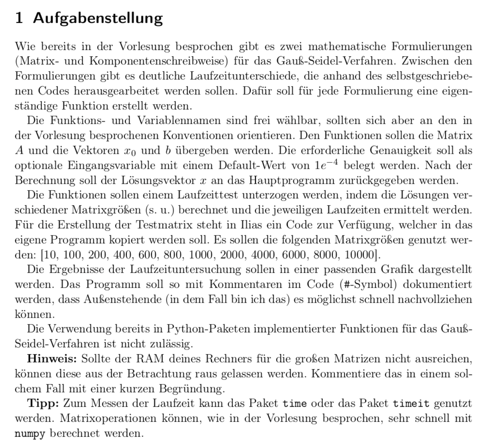
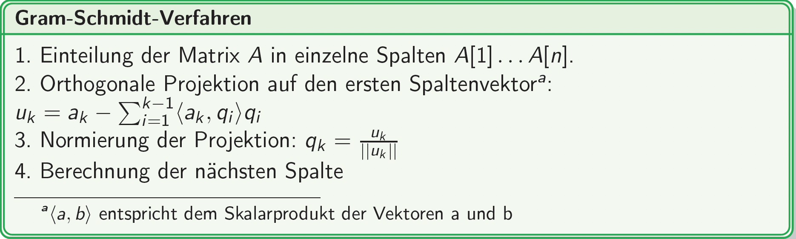
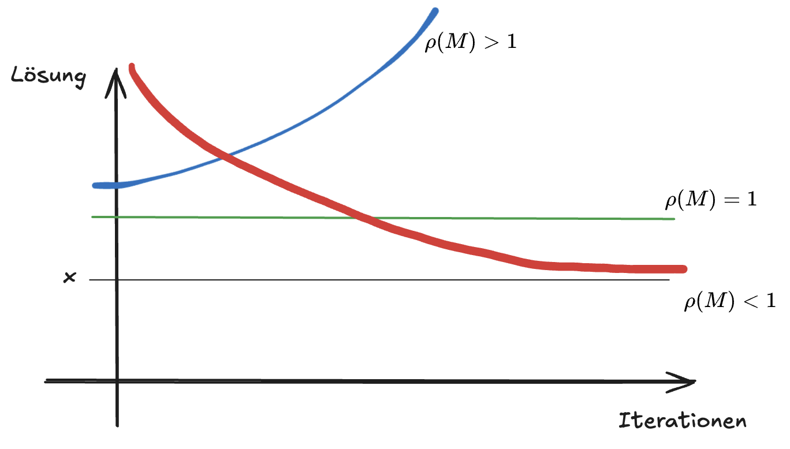
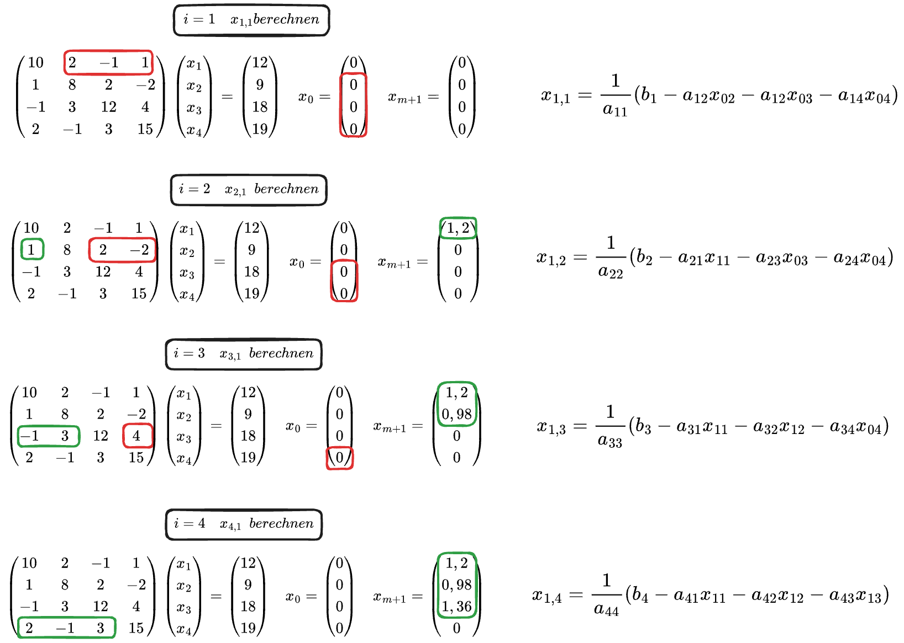

# Literatur 
- Bernd Klein: Einführung in Python
- Bernd Klein: Numerisches Python
- Woyand: Python für Ingenieure und Naturwissenschaftler
- Martin Hermann: Numerische Mathematik 1
# Klausur
30 % der Note durch Programmieraufgabe und Fachgespräch (10 min.)
70 % der Note Klausur (Programmcode schreiben, Numerische Verfahren)
Geschrieben im PC-Pool, programmieren in IDLE

# Programmieraufgabe 

## Teile der Aufgabe
- Vergleich der beiden Gauß-Seidel-Verfahren (Matrix- und Komponentenschreibweise)
- Laufzeitvergleich bei Matrizen mit unterschiedlichen Dimensionen
- Funktionsparameter $\rightarrow$ Matrix $A$ und Vektoren $x_0$ und $b$ 
	- optionaler Parameter $\rightarrow$ Genauigkeit mit default-Wert $1e^{-4}$ 
- Testmatrix mit vorgegebener Funktion aus Ilias erstellen
### Zahlenformate
In Computerprogrammen werden aufgrund der begrenzten Speicherlänge (8, 16, 32 bit) andere Zahlenformate definiert als in der Mathematik. Darunter:
- Integer
- Floats
- Boolsche Werte (True, (1), False (0))
- Complex
Die mögliche Länge eines Integer wird durch den Arbeitsspeicher des Rechners festgelegt
**Wichtig** $\rightarrow$ eine Datentypumwandlung ist **keine** Rundungsoperation! 
float $\rightarrow$ int die Ziffern hinter dem Komma werden abgeschnitten
#### Zahlensysteme
##### Binär
- Basis 2 
- Nullen und Einsen
- entspricht der Maschinensprache 
Binärsystem: 1001101
$$
1 \cdot 2^6 + 0 \cdot 2^5 + 0 \cdot 2^4 + 1 \cdot 2^3 + 1 \cdot 2^2 + 0 \cdot 2^1 + 1 \cdot 2^0 = 77
$$
##### Hexadezimal
- Basis 16
- am platzsparendsten
Beispiel: 1D47
$$
1 \cdot 16^3 + 13 \cdot 16^2 + 4 \cdot 16^1 + 7 \cdot 16^0 = 7495
$$
#### Aufbau Fließkommazahlen
- Vorzeichenbit (1 bit)
	- Gibt das Vorzeichen an (0 = positiv, 1 = negativ)
- Exponentenbits (11 bits)
	- Gibt an wohin das Dezimalzeichen platziert wird
- Mantissenbits (52 bits)

Beispiel: 
1 | 0110 | 110001100111
$\rightarrow$ Vorzeichen negativ
$\rightarrow$ Dezimalzeichen um 6 Stellen verschoben (0110 = 6)
$\rightarrow$ alles dahinter geben die Zahlen vor und nach dem Dezimalzeichen an

## Fehler 
Buch: Martin Hermann; Numerik und Programmierung
### Fehlertypen
#### Eingabefehler 
- Liegen vor Beginn der Berechnung fest 
- können Werte aus vorheriger Messung oder Berechnung
- unvermeidbarer Fehler
#### Approximationsfehler
- unendlicher mathematischer Prozess durch endliche Berechnungsvorschrift ersetzen
- Approximieren von unendlichen Zahlen ($\pi,~e$)
- Bestimmtes Integral
#### Rundungsfehler
- Werte werden zur Anschaulichkeit gerundet
- dadurch können Rundungsfehler entstehen
- i. d. Regel sehr klein
- können sich fortpflanzen
#### Menschlicher Fehler / Irrtum
- grundlegende Fehler mathematischen/numerischen Modell
- konkrete Bedingung werden durch Fehlannahmen im Programm nicht zugelassen
- Debugging über Unit-testing (https://en.wikipedia.org/wiki/Unit_testing)

### Nullstellenalgorithmen
- Algorithmen zur Bestimmung der Nullstellen einer Funktion
#### Einführung
- Analystische Mathematik $\rightarrow$ $f(x) = 0$
- In der Numerik werden iterative Verfahren angewendet 
- Vorraussetzungen:
	- Hat die Funktion Nullstellen?
	- Gibt es einen Bereich, in dem eine Nullstelle vorkommt?
- Vorraussetzungen können mit einem **Zwischenwertsatz** geprüft werden:
	- Funktion in einem Bereich [a, b] $\rightarrow~\mathbb{R}$ stetig
	- Bedingung: $f(a) \le 0 \le f(b)$ oder $f(b) \le 0 \le f(a)$ 

#### Tangentenverfahren
- An einem Startpunkt wird die Tangente angelegt
- An der Schnittstelle mit der x-Achse wird die nächste Tangente angelegt
- [Tangentenverfahren](https://de.wikipedia.org/wiki/Newtonverfahren#)
- Notwendiges Kriterium für den Startpunkt:
	- $f'(x) \neq 0$ $\rightarrow$ Steigung am Startwert darf nicht Null sein 
- Hinreichendes Kriterium 

#### Sekantenverfahren
- Sekantenverfahren benötigt keine Ableitung
- Konvergenzgeschwindigkeit etwas schlechter als bei Tangentenverfahren
- basieren auf der Taylor-Reihen-Entwicklung 
#### Steffensen-Verfahren
- Gutes Konvergenzverhalten
- es wird keine Ableitung benötigt 
# Lineare Gleichungssysteme
Es gibt iterative und direkte Verfahren. Die direkten Verfahren stellen die analytischen Verfahren dar wie zum Beispiel der Gauß-Algorithmus. Die iterativen Verfahren werden häufiger in der Numerik verwendet.
## Gauß-Algorithmus am Computer
Überführung der Matrix A in die Dreiecksmatrizen LR erfolgt durch schrittweises Multiplizieren mit einer [**Frobenius-Matrix**](https://de.wikipedia.org/wiki/Frobeniusmatrix) 
Eine Matrix ist eine Frobeniusmatrix, wenn sie die folgenden drei Eigenschaften aufweist:
- auf der [Hauptdiagonale](https://de.wikipedia.org/wiki/Hauptdiagonale "Hauptdiagonale") stehen nur Einsen
- in höchstens einer Spalte stehen unter der Hauptdiagonale beliebige Einträge
- alle anderen Einträge sind Null

- $n$ stellt hier die Dimension der Matrix dar. Wenn ich eine 3x3 habe ist $n=3$ 
- Liste für $i$ = ```[1, 2]```
- Liste für $j$ = ```[2, 3]```
Wichtig für den Algorithmus ist das A regulär ist ($det(A) \neq 0$) und keine Nullen auf der hauptdiagonale besitzt
```python
import numpy as np

A = np.array([[1,1,1],
			  [1,2,4],
			  [1,3,5] ])

b = np.array([6, 17, 22]).T

L1 = np.array([[1,0,0],
			  [-1,1,0],
			  [-1,0,-1]])
			  
```
- Pivotisierung kann notwendig werden wenn im Laufe des Algorithmus ein Element der Hauptdiagonale zu Null wird. Ob eine Pivotisierung notwendig ist, kann durch die Determinanten der Hauptabschnittsmatrizen bestimmt werden. Wenn diese gleich null ist, muss der Algorithmus um eine Permutationsmatrix erweitert werden.

## Cholesky-Algorithmus
Die Cholesky-Zerlegung beschreibt einen Spezialfall der LR-Zerlegung, bei der die zu zerlegende Matrix symmetrisch (notwendig) und positiv definit (hinreichend) ist. Ziel ist es ein solches LGS einfacher lösbar zu machen. Kriterien für positive Definitheit sind:
- Nur positive Eigenwerte
- Nur positive Hauptabschnittsdeterminanten (auch Hauptminoren)
- Alle HD-Elemente sind positiv (notwendiges, aber nicht hinreichendes Kriterium)
**Ziel:** $A = LL^T$
Rechenvorschrift:

$a_{kk}$ sind die Hautpdiagonalelemente der Matrix. 
Beim $\sum$ steht $j=1$ für die Laufvariable, welche bei 1 startet, $k-1$ gibt an wann wir aufhören zu summieren. Bei $k=3$ summieren wir bis $j=2$ . 
### Cholesky-Zerlegung von Matrix A

**Matrix A:**
$$
A = \begin{pmatrix} 4 & 2 & 2 & 0 \\ 2 & 2 & 4 & -1 \\ 2 & 4 & 14 & -5 \\ 0 & -1 & -5 & 11 \end{pmatrix}
$$

**k = 1 (Erste Spalte)**
Da $j=1$ bis $k-1$ läuft, ist die Summe hier leer ($0$).

* **Diagonalelement:**
  $a_{11} = \sqrt{a_{11}} = \sqrt{4} = \mathbf{2}$
* **Elemente darunter (i = 2, 3, 4):**
  $a_{21} = \frac{a_{21}}{a_{11}} = \frac{2}{2} = \mathbf{1}$
  $a_{31} = \frac{a_{31}}{a_{11}} = \frac{2}{2} = \mathbf{1}$
  $a_{41} = \frac{a_{41}}{a_{11}} = \frac{0}{2} = \mathbf{0}$

**k = 2 (Zweite Spalte)**
Abzug der Einflüsse aus Spalte $j=1$.

* **Diagonalelement:**
  $a_{22} = \sqrt{a_{22} - a_{21}^2} = \sqrt{2 - 1^2} = \sqrt{1} = \mathbf{1}$
* **Elemente darunter (i = 3, 4):**
  $a_{32} = \frac{a_{32} - (a_{31} \cdot a_{21})}{a_{22}} = \frac{4 - (1 \cdot 1)}{1} = \mathbf{3}$
  $a_{42} = \frac{a_{42} - (a_{41} \cdot a_{21})}{a_{22}} = \frac{-1 - (0 \cdot 1)}{1} = \mathbf{-1}$

**k = 3 (Dritte Spalte)**
Abzug der Einflüsse aus den Spalten $j=1$ und $j=2$.

* **Diagonalelement:**
  $a_{33} = \sqrt{a_{33} - (a_{31}^2 + a_{32}^2)} = \sqrt{14 - (1^2 + 3^2)} = \sqrt{4} = \mathbf{2}$
* **Element darunter (i = 4):**
  $a_{43} = \frac{a_{43} - (a_{41} a_{31} + a_{42} a_{32})}{a_{33}} = \frac{-5 - (0 \cdot 1 + (-1) \cdot 3)}{2} = \frac{-2}{2} = \mathbf{-1}$
#### Aufbau als Code
Liste wird hier nur bis 3 erstellt, da Numpy von 0 anfängt zu zählen. Da Numpy zusätzlich beim Slicen (z.B. ```A[:k, k]```) exklusiv zählt, muss kein k+1 gesetzt werden. Es hebt sich dabei gegenseitig auf.
```python
import numpy as np 
# Deine Beispiel-Matrix 
A = np.array([[4, 2, 2, 0], 
			  [2, 2, 4, -1], 
			  [2, 4, 14, -5], 
			  [0, -1, -5, 11]])
			  
n = A.shape[0] # Gibt hier 4 aus 
L = np.zeros_like(A) # Wir erstellen eine leere Matrix für das Ergebnis

for k in range(n): # k = 2
	for i in range(k, n): # i = 2 
		if i == k: # Diagonalelemente 
		# Hier nutzt du dein Slicing: Summe der Quadrate der bereits berechneten L-Werte 
			summe = np.sum(L[k, :k]**2) 
			L[k, k] = np.sqrt(A[k, k] - summe) 
		else: # Elemente unterhalb der Diagonale # Hier nutzt du das Skalarprodukt der bisherigen Zeilenanteile 
			summe = np.sum(L[i, :k] * L[k, :k]) 
			L[i, k] = (A[i, k] - summe) / L[k, k] 


```
## QR-Zerlegung
### Anforderungen
- Matrix muss regulär sein $\rightarrow$ $det \neq 0$ 
- Keine anderen Anforderungen, deshalb immer nutzbar als einziges direktes Verfahren
### Rechenvorschrift 

$\|u_1\|$ $\rightarrow$  Euklidische Norm gibt die geometrische Länge des Vektors an 
$\|u_1\| = \sqrt{x^2 + y² + z^2}$ 
### Beispielrechnung
$$
A = \begin{pmatrix} 2 & 1 & 3 \\ -1 & -4 & 1 \\ 1 & 2 & -4 \end{pmatrix}
$$
**1 Einteilung der Matrix $A$ in einzelne Spalten**
Die Matrix $A$ wird in ihre Spaltenvektoren zerlegt:
 $a_1 = \begin{pmatrix} 2 \\ -1 \\ 1 \end{pmatrix}$   $a_2 = \begin{pmatrix} 1 \\ -4 \\ 2 \end{pmatrix}$  $a_3 = \begin{pmatrix} 3 \\ 1 \\ -4 \end{pmatrix}$ 

**2 Orthogonale Projektion und Normierung**
**Berechnung für $k=1$:**
* **Orthogonaler Vektor**: Da $k-1 = 0$, gibt es keine Summe: $u_1 = a_1 = \begin{pmatrix} 2 \\ -1 \\ 1 \end{pmatrix}$
* **Normierung**: $q_1 = \frac{u_1}{\|u_1\|}$
  * $\|u_1\| = \sqrt{2^2 + (-1)^2 + 1^2} = \sqrt{6}$
  * **Ergebnis**: $q_1 = \frac{1}{\sqrt{6}} \begin{pmatrix} 2 \\ -1 \\ 1 \end{pmatrix}$

**Berechnung für $k=2$:**
* **Orthogonale Projektion**: $u_2 = a_2 - \langle a_2, q_1 \rangle q_1$
  * Skalarprodukt $\langle a_2, q_1 \rangle = \frac{1}{\sqrt{6}} (1\cdot2 + (-4)\cdot(-1) + 2\cdot1) = \frac{8}{\sqrt{6}}$
  * $u_2 = \begin{pmatrix} 1 \\ -4 \\ 2 \end{pmatrix} - \frac{8}{\sqrt{6}} \cdot \frac{1}{\sqrt{6}} \begin{pmatrix} 2 \\ -1 \\ 1 \end{pmatrix} = \begin{pmatrix} 1 \\ -4 \\ 2 \end{pmatrix} - \frac{4}{3} \begin{pmatrix} 2 \\ -1 \\ 1 \end{pmatrix} = \begin{pmatrix} -5/3 \\ -8/3 \\ 2/3 \end{pmatrix}$
* **Normierung**: $q_2 = \frac{u_2}{\|u_2\|}$
  * $\|u_2\| = \sqrt{(-5/3)^2 + (-8/3)^2 + (2/3)^2} = \frac{\sqrt{93}}{3}$
  * **Ergebnis**: $q_2 = \frac{1}{\sqrt{93}} \begin{pmatrix} -5 \\ -8 \\ 2 \end{pmatrix}$

**Berechnung für $k=3$:**
* **Orthogonale Projektion**: $u_3 = a_3 - \langle a_3, q_1 \rangle q_1 - \langle a_3, q_2 \rangle q_2$
  * Skalarprodukt $\langle a_3, q_1 \rangle = \frac{1}{\sqrt{6}} (3\cdot2 + 1\cdot(-1) + (-4)\cdot1) = \frac{1}{\sqrt{6}}$
  * Skalarprodukt $\langle a_3, q_2 \rangle = \frac{1}{\sqrt{93}} (3\cdot(-5) + 1\cdot(-8) + (-4)\cdot2) = \frac{-31}{\sqrt{93}}$
  * $u_3 = \begin{pmatrix} 3 \\ 1 \\ -4 \end{pmatrix} - \frac{1}{6} \begin{pmatrix} 2 \\ -1 \\ 1 \end{pmatrix} + \frac{31}{93} \begin{pmatrix} -5 \\ -8 \\ 2 \end{pmatrix} = \begin{pmatrix} 1 \\ -3/2 \\ -7/2 \end{pmatrix}$
* **Normierung**: $q_3 = \frac{u_3}{\|u_3\|}$
  * $\|u_3\| = \sqrt{1^2 + (-1.5)^2 + (-3.5)^2} = \sqrt{15.5}$
  * **Ergebnis**: $q_3 = \frac{1}{\sqrt{15.5}} \begin{pmatrix} 1 \\ -1.5 \\ -3.5 \end{pmatrix}$
## Iterative Verfahren
Man braucht zwar deutlich mehr Rechenschritte es gibt allerdings mehrere Vorteile:
- Implementierung direkter Verfahren recht aufwändig
- Matrizen häufig schwach besetzt, z.B. nur HD besetzt. Das kann bei der Berechnung der Inversen bei direkten Verfahren zu stark besetzten Matrizen führen, was bei großen LGS zu großen Speicherbedarf führen kann
- Direkte Verfahren könne besondere Strukturen nicht berücksichtigen (z.B. Tridiagonalmatrix o.ä.)
- Bessere Skalierbarkeit
- Genauigkeit der Lösung kann besser beeinflusst werden
- Einfachere Parallelisierung der Operationen
### Splitting Verfahren
> [!NOTE] Definition
> Ausgehend von der Problemstellung $Ax=b$ heißt ein Iterationsverfahren linear, wenn Matrizen $M, N \in \mathbb{C}^{n \times n}$ existieren, welche die Gleichung $$
> \phi(x,b) = Mx + Nb$$ erfüllen. Die Matrix M stellt in der Gleichung die Iterationsmatrix der Iteration $\phi$ dar.
#### Konsistenz
Konsistenz ist eine notwendige Bedingung bei der Anwendung iterativer Verfahren. Diese lässt sich über folgende Beziehung nachweisen:
$$ M = I - NA $$Ein inkonsistentes Verfahren müsste durch den Nutzer manuell an der richtigen Stelle abgebrochen werden, weil sich das Verfahren nach der Annäherung an die richtige Lösung, wieder von ihr entfernen würde. Die Beurteilung, ob die richtige Lösung erreicht wurde, kann häufig jedoch gar nicht durch den Nutzer sichergestellt werden.
#### Konvergenz 
Ein lineares Iterationsverfahren ist dann konvergent, wenn der Spektralradius, der größte Eigenwert $(\rho(M))$, kleiner als 1 ist. Dies ist eine notwendige und hinreichende Bedingung für alle Splitting-Verfahren. Konvergent bedeutet, dass die Rechenvorschrift gegen einen Wert festen Wert läuft (gleichbedeutend dem Limes). Hintergrund ist, dass der Fehler in jeder Iteration mit seinem Eigenwert multipliziert wird. Ist nun der größte Eigenwert größer als 1 wird der Fehler im Laufe der Berechnung immer größer (Divergenz). Bei einem Spektralradius von 1 ändert sich der Ausgangsfehler nicht und es liegt weder Divergenz, noch Konvergenz vor. Nur wenn der Spektralradius kleiner als 1 ist verringert sich der Fehler mit jeder Iteration. Früher war die Berechnung der Eigenwerte aufwändig, weshalb man in der Regel einfachere hinreichende Kriterien formuliert hat.

### Aufbau Splitting Verfahren
Diese basieren auf einer Aufteilung der Matrix. Diese Aufteilung erfolgt nach folgendem Muster $$ A = B + (A - B), B \in \mathbb{C}^{n \times n}$$ sodass sich $Ax=b$ zu $$ x = B^{-1}(B-A)x +B^{-1}b $$
ergibt. So kann man $$ x_{m+1} = \phi(x_m, b) = Mx_m + Nb $$
mit $$ M = B^{-1}(B-A)~\text{und}~N = B^{-1} $$ analog zu der charakteristischen Gleichung für lineare Iterationsverfahren formulieren.
## Jacobi Verfahren
- setzt auf nicht verschwindene Diagonalelemente
- Matrix $A$ wird durch $A = D + ( A-D)$  ersetzt
- Einsetzen in charakteristische Gleichung liefert $x_{m+1} = D^{-1}(D-A)x_m+D^{-1}b$  
- $m$ entspicht dem Iterationsschritt 
Daraus ergibt sich eine allgemeine Berechnungsvorschrift: $$ x_{m+1,i} = \frac{1}{a_{ii}} (b_i - \sum_{j=1, j\neq i}^n a_{ij}x_{m,j}) $$
## Gauß-Seidel-Verfahren
Dieses Verfahren basiert auf einer Zerlegung des LGS in eine Diagonalmatrix $D$, eine strikte linke untere Dreiecksmatrix $L$ sowie eine strikte rechte untere Dreiecksmatrix $R$. $$ A = L+D+R $$Strikt bedeutet hier, dass alle Elemente der Hauptdiagonale gleich Null sind. $$ \begin{gather}
L = l_{ij}, \quad l_{ij} = \begin{cases} a_{ij}, & i > j \\ 0, & \text{sonst} \end{cases} \\
\\
R = r_{ij}, \quad r_{ij} = \begin{cases} a_{ij}, & i < j \\ 0, & \text{sonst} \end{cases} \\
\\
D = d_{ij}, \quad d_{ij} = \begin{cases} a_{ij}, & i = j \\ 0, & \text{sonst} \end{cases}
\end{gather}$$
Die Zerlegung des LGS liefert folgende Form des LGS: $$(L + D + R)x = b$$
Dieses Gleichungssystem kann nun umgeformt werden, indem die Inverse von $(L+D+R)$ von links multipliziert wird. Das liefert: $$x=(L+D+R)^{-1}b$$
Diese Form der Gleichung hat allerdings den Nachteil, dass hierzu die Inverse der Matrix $A$ bzw. die Inversen von $L,D,R$ berechnet werden müssen. Bei sehr großen LGS (z.B. $10^6\times10^6$) , wie sie in Simulationen häufig vorkommen, würde es ewig dauern die Inverse zu berechnen und man bräuchte sehr viel RAM für die Berechnung. Deshalb versucht man bei iterativen Verfahren das Problem in kleinere Rechnungen zu zerlegen. Deshalb wird folgende iterative Form der Gleichung bei Gauß-Seidel verwendet $$x_{m+1}=-(L+D)^{-1}Rx_m+(L+D)^{-1}b$$
Diese Gleichung stellt die Matrizenform des Verfahrens dar. Es ist auch möglich das Verfahren in Indexschreibweise zu formulieren$$ x_{m+1,i} = \frac{1}{a_{ii}}\left( b_i-\sum^{i-1}_{j=1}a_{ij}x_{m+1,j} - \sum^n_{j=i+1}a_{ij}x_{m,j}\right)$$
$m+1 \rightarrow$ Lösungsvektor für den nächsten Iterationsschritt
$i \rightarrow$ Zeilenindex, bei einem Vektor mit drei Zeilen ist $i \in [1, 2, 3]$ 
$j \rightarrow$ Spaltenindex 
$\sum^{i-1}_{j=1} \rightarrow$ Summe, Start bei $j=1$ bis zu $i-1$ 

Hierbei kann man sagen, dass sich die linke Summe wie die Berechnung von Skalarprodukten behandeln lässt. Da durch die Vorschrift immer das Skalarprodukt aus den einzelnen Zeilen (bzw. Spaltenvektoren) mit der Lösungsmatrix aus dem aktuellen sowie dem Iterationsschritt berechnet wird kann in Python mit dem ```np.dot``` Funktion gearbeitet werden. Der Zusammenhang ist in der untenstehenden Darstellung verdeutlicht. Hier steht **Grün** für die linke Summe und **Rot** steht für die rechte Summe.


### Ablauf Indexschreibweise
Beispiel LGS: $$ \begin{pmatrix} 4 & 1 \\ 1 & 3 \end{pmatrix} \cdot \begin{pmatrix} x_1 \\ x_2 \end{pmatrix} = \begin{pmatrix} 5 \\ 4 \end{pmatrix} $$
1. Der Zeilenvektor $x$ wird als Startwert zu einem Nullvektor gesetzt
```python
import numpy as np

x_0 = np.zeros(2)
print(x_0)
```
2. Erster Iterationsschritt: $i=1,\quad j=1$  $$a_{11} = 4, \quad b_1 = 5$$ Der erste Summenteil fällt raus, weil es noch keinen vorherigen Iterationsschritt gibt. Der zweite Summenteil wird zu: $$ \left(a_{12}*x_2 \right) $$
3. Das erste $x_{m+1}$ wird also zu: $$ \frac{1}{4} (5-1\cdot0) = 1.25$$
4. Zweiter Iterationsschritt: $i=1, \quad j=2$ 
	1. Erster Summenteil:$$ (a_{1}) $$


## Mehrgitterverfahren
Man startet auf dem ersten Gitte und iteriert bis sich die hochfrequenten Fehler geglättet haben und springt dann auf ein gröberes Gitter mit vereinfachtem LGS. Dort können die hochfrequenten Fehler auch mit wenigen Iterationen geglättet werden.

### Beispiel
1. $$Ax_{new} = b$$             $$r_{new} = b - A_{new}$$
2. $$ R~r_{new} \approx 0$$
3. $$R~(b-Ax_{new}) \approx 0~~~~~x_{new} = x + \Delta x = x + P \Delta x'$$
4. $$ R~(b-A~(x+P\Delta x')) \approx 0$$
5. $$R~(b-Ax-AP\Delta x') \approx 0 \rightarrow R~(r-A\Delta x') \approx 0 \rightarrow Rr-RAP\Delta x' \approx 0$$
6. $$A'\Delta x' \approx r'~~~\text{mit}~~~A' = RAP$$
## Unterraumverfahren
### Conjugate-Gradient Methode

Das CG-Verfahren löst lineare Gleichungssysteme der Form $Ax = b$, wenn die Matrix $A$ symmetrisch und positiv definit ist.
#### Allgemeine Formeln

**Schritt 1: Initialisierung (Iteration $k = 0$)**

1. **Initiales Residuum berechnen:**
   $$r_0 = b - A x_0$$

2. **Erste Suchrichtung festlegen:**
   $$p_0 = r_0$$

---

**Schritt 2: Die Iterationsschleife (für $k = 0, 1, 2, \dots$)**

Diese Schritte werden so lange wiederholt, bis das Residuum $r_k$ ausreichend klein ist (Konvergenz).

1. **Schrittweite $\alpha_k$ berechnen:**
   $$\alpha_k = \frac{r_k^T r_k}{p_k^T A p_k}$$

2. **Lösungsvektor aktualisieren:**
   $$x_{k+1} = x_k + \alpha_k p_k$$

3. **Neues Residuum berechnen:**
   $$r_{k+1} = r_k - \alpha_k A p_k$$

4. **Abbruchkriterium prüfen:**
   Wenn $\|r_{k+1}\|$ unter einer vorgegebenen Toleranz liegt $\rightarrow$ **Stopp**.

5. **Korrekturfaktor $\beta_k$ berechnen:**
   $$\beta_k = \frac{r_{k+1}^T r_{k+1}}{r_k^T r_k}$$

6. **Neue Suchrichtung berechnen:**
   $$p_{k+1} = r_{k+1} + \beta_k p_k$$

---
*Hinweis: Nach Schritt 6 wird $k$ um 1 erhöht ($k = k+1$) und die Schleife beginnt wieder bei Punkt 1.*

#### Anwendungsbeispiel

**Gegebene Werte:**
$$A = \begin{pmatrix} 2 & 0 \\ 0 & 4 \end{pmatrix}, \quad b = \begin{pmatrix} 1 \\ -1 \end{pmatrix}, \quad x_0 = \begin{pmatrix} 0 \\ 0 \end{pmatrix}$$
--- 

**Schritt 1: Initialisierung (Iteration 0)**

Zuerst berechnen wir das erste Residuum $r_0$ (den Fehler) und die erste Suchrichtung $p_0$.

1. **Residuum $r_0$ berechnen:**
   $$r_0 = b - Ax_0 = \begin{pmatrix} 1 \\ -1 \end{pmatrix} - \begin{pmatrix} 2 & 0 \\ 0 & 4 \end{pmatrix} \begin{pmatrix} 0 \\ 0 \end{pmatrix} = \begin{pmatrix} 1 \\ -1 \end{pmatrix}$$

2. **Erste Suchrichtung $p_0$ festlegen:**
   Im ersten Schritt entspricht die Suchrichtung genau dem Residuum:
   $$p_0 = r_0 = \begin{pmatrix} 1 \\ -1 \end{pmatrix}$$

---

**Schritt 2: Erste Iteration (Berechnung von $x_1$)**

Wir bestimmen die Schrittweite $\alpha_0$, aktualisieren den Lösungsvektor zu $x_1$ und berechnen das neue Residuum $r_1$.

1. **Hilfskonstruktion $A p_0$ berechnen:**
   $$A p_0 = \begin{pmatrix} 2 & 0 \\ 0 & 4 \end{pmatrix} \begin{pmatrix} 1 \\ -1 \end{pmatrix} = \begin{pmatrix} 2 \\ -4 \end{pmatrix}$$

2. **Schrittweite $\alpha_0$ berechnen:**
   Formel: $$\alpha_0 = \frac{r_0^T r_0}{p_0^T A p_0}$$
   * Zähler: $r_0^T r_0 = 1 \cdot 1 + (-1) \cdot (-1) = 1 + 1 = 2$
   * Nenner: $p_0^T A p_0 = \begin{pmatrix} 1 & -1 \end{pmatrix} \begin{pmatrix} 2 \\ -4 \end{pmatrix} = 1 \cdot 2 + (-1) \cdot (-4) = 2 + 4 = 6$
   $$\alpha_0 = \frac{2}{6} = \frac{1}{3}$$

3. **Neuen Lösungsvektor $x_1$ berechnen:**
   $$x_1 = x_0 + \alpha_0 p_0 = \begin{pmatrix} 0 \\ 0 \end{pmatrix} + \frac{1}{3} \begin{pmatrix} 1 \\ -1 \end{pmatrix} = \begin{pmatrix} \frac{1}{3} \\ -\frac{1}{3} \end{pmatrix}$$

4. **Neues Residuum $r_1$ berechnen:**
   $$r_1 = r_0 - \alpha_0 A p_0 = \begin{pmatrix} 1 \\ -1 \end{pmatrix} - \frac{1}{3} \begin{pmatrix} 2 \\ -4 \end{pmatrix} = \begin{pmatrix} 1 - \frac{2}{3} \\ -1 + \frac{4}{3} \end{pmatrix} = \begin{pmatrix} \frac{1}{3} \\ \frac{1}{3} \end{pmatrix}$$

---

**Schritt 3: Vorbereitung für die nächste Iteration (Suchrichtung $p_1$)**

Da $r_1 \neq 0$, bestimmen wir eine neue, zu $p_0$ konjugierte Suchrichtung $p_1$.

1. **Korrekturfaktor $\beta_0$ berechnen:**
   Formel: $$\beta_0 = \frac{r_1^T r_1}{r_0^T r_0}$$
   * Zähler: $r_1^T r_1 = \frac{1}{3} \cdot \frac{1}{3} + \frac{1}{3} \cdot \frac{1}{3} = \frac{1}{9} + \frac{1}{9} = \frac{2}{9}$ $\rightarrow$ $\begin{pmatrix} 1/3 & 1/3 \end{pmatrix} \cdot \begin{pmatrix} 1/3 \\ 1/3 \end{pmatrix}$  
   * Nenner: $r_0^T r_0 = 2$
   $$\beta_0 = \frac{\frac{2}{9}}{2} = \frac{1}{9}$$

2. **Neue Suchrichtung $p_1$ berechnen:**
   $$p_1 = r_1 + \beta_0 p_0 = \begin{pmatrix} \frac{1}{3} \\ \frac{1}{3} \end{pmatrix} + \frac{1}{9} \begin{pmatrix} 1 \\ -1 \end{pmatrix} = \begin{pmatrix} \frac{3}{9} + \frac{1}{9} \\ \frac{3}{9} - \frac{1}{9} \end{pmatrix} = \begin{pmatrix} \frac{4}{9} \\ \frac{2}{9} \end{pmatrix}$$

---

**Zwischenstand nach der ersten Iteration:**
* **Aktuelle Näherung:** $x_1 = \begin{pmatrix} \frac{1}{3} \\ -\frac{1}{3} \end{pmatrix}$
* **Nächste Suchrichtung:** $p_1 = \begin{pmatrix} \frac{4}{9} \\ \frac{2}{9} \end{pmatrix}$

---

1. **Hilfskonstruktion $A p_1$ berechnen:**
   $$A p_1 = \begin{pmatrix} 2 & 0 \\ 0 & 4 \end{pmatrix} \begin{pmatrix} \frac{4}{9} \\ \frac{2}{9} \end{pmatrix} = \begin{pmatrix} 2 \cdot \frac{4}{9} \\ 4 \cdot \frac{2}{9} \end{pmatrix} = \begin{pmatrix} \frac{8}{9} \\ \frac{8}{9} \end{pmatrix}$$

2. **Schrittweite $\alpha_1$ berechnen:**
   Formel: $$\alpha_1 = \frac{r_1^T r_1}{p_1^T A p_1}$$
   * Zähler (haben wir schon aus Schritt 3): $r_1^T r_1 = \frac{2}{9}$
   * Nenner: $p_1^T A p_1 = \begin{pmatrix} \frac{4}{9} & \frac{2}{9} \end{pmatrix} \begin{pmatrix} \frac{8}{9} \\ \frac{8}{9} \end{pmatrix} = \frac{4}{9} \cdot \frac{8}{9} + \frac{2}{9} \cdot \frac{8}{9} = \frac{32}{81} + \frac{16}{81} = \frac{48}{81} = \frac{16}{27}$
   $$\alpha_1 = \frac{\frac{2}{9}}{\frac{16}{27}} = \frac{2}{9} \cdot \frac{27}{16} = \frac{3}{8}$$

3. **Lösungsvektor $x_2$ berechnen:**
   $$x_2 = x_1 + \alpha_1 p_1 = \begin{pmatrix} \frac{1}{3} \\ -\frac{1}{3} \end{pmatrix} + \frac{3}{8} \begin{pmatrix} \frac{4}{9} \\ \frac{2}{9} \end{pmatrix} = \begin{pmatrix} \frac{1}{3} \\ -\frac{1}{3} \end{pmatrix} + \begin{pmatrix} \frac{12}{72} \\ \frac{6}{72} \end{pmatrix} = \begin{pmatrix} \frac{1}{3} \\ -\frac{1}{3} \end{pmatrix} + \begin{pmatrix} \frac{1}{6} \\ \frac{1}{12} \end{pmatrix}$$
   
   Auf den Hauptnenner gebracht:
   $$x_2 = \begin{pmatrix} \frac{4}{12} + \frac{2}{12} \\ -\frac{4}{12} + \frac{1}{12} \end{pmatrix} = \begin{pmatrix} \frac{6}{12} \\ -\frac{3}{12} \end{pmatrix} = \begin{pmatrix} \frac{1}{2} \\ -\frac{1}{4} \end{pmatrix}$$

4. **Neues Residuum $r_2$ berechnen:**
   $$r_2 = r_1 - \alpha_1 A p_1 = \begin{pmatrix} \frac{1}{3} \\ \frac{1}{3} \end{pmatrix} - \frac{3}{8} \begin{pmatrix} \frac{8}{9} \\ \frac{8}{9} \end{pmatrix} = \begin{pmatrix} \frac{1}{3} \\ \frac{1}{3} \end{pmatrix} - \begin{pmatrix} \frac{24}{72} \\ \frac{24}{72} \end{pmatrix} = \begin{pmatrix} \frac{1}{3} \\ \frac{1}{3} \end{pmatrix} - \begin{pmatrix} \frac{1}{3} \\ \frac{1}{3} \end{pmatrix} = \begin{pmatrix} 0 \\ 0 \end{pmatrix}$$

---

## Ergebnis
Das Residuum $r_2$ ist exakt $\begin{pmatrix} 0 \\ 0 \end{pmatrix}$. Das Verfahren bricht hier ab, und wir haben die exakte Lösung des Gleichungssystems gefunden:
$$x_{final} = \begin{pmatrix} 0.5 \\ -0.25 \end{pmatrix}$$

*(Gegenprobe: $A \cdot x_{final} = \begin{pmatrix} 2 & 0 \\ 0 & 4 \end{pmatrix} \begin{pmatrix} 0.5 \\ -0.25 \end{pmatrix} = \begin{pmatrix} 1 \\ -1 \end{pmatrix} = b \checkmark$)*

 